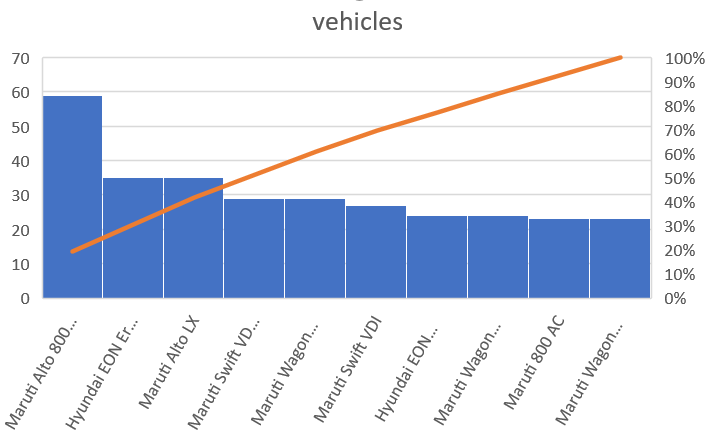

# map-reduce-tata

# Type of Data 
The data I have choosen for this assigment is about used cars. This data can be used for a lot of purposes such as price prediction to exemplify the use of linear regression in Machine Learning. The data set I have choosen consists of 8 different data columns with the continent,respective Kilo-Meters Driven and many more.The dataset consists of 4341 records. 

Link for Data : [Vehicle dataset](https://www.kaggle.com/nehalbirla/vehicle-dataset-from-cardekho)  

